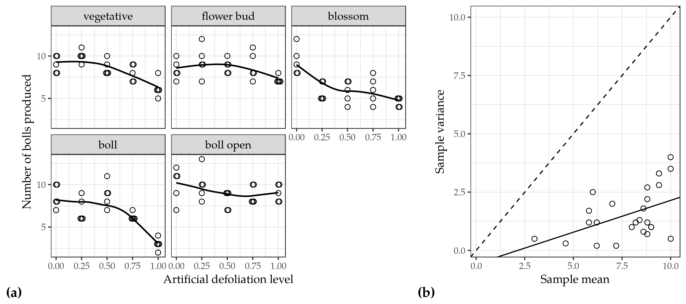
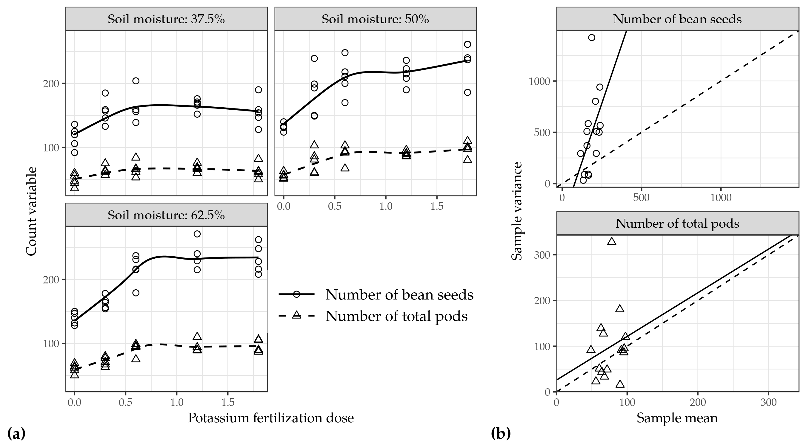
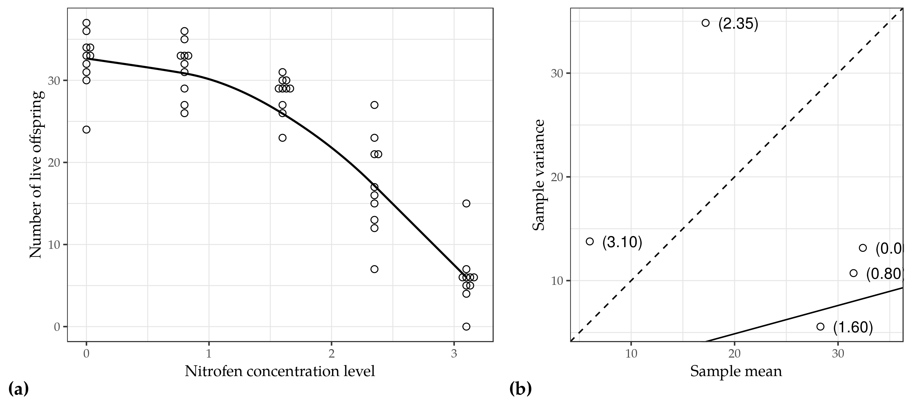
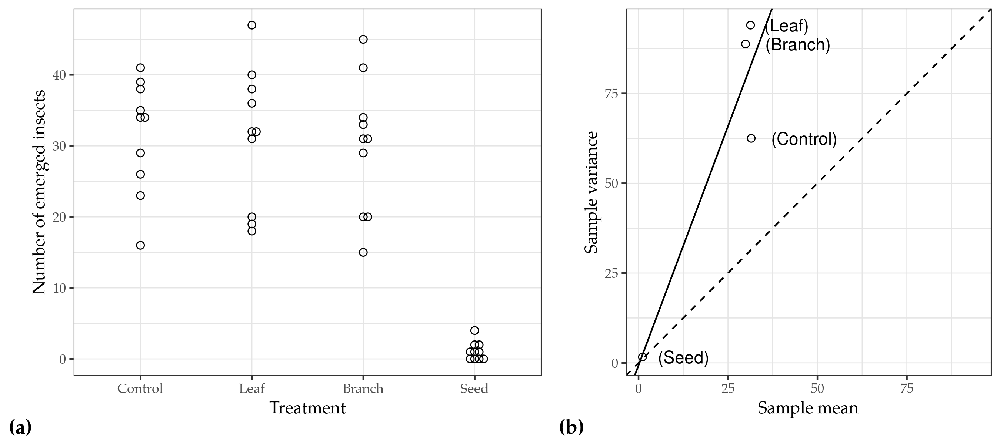

Chapter: Motivating datasets
================
Eduardo E. Ribeiro Jr (<jreduardo@usp.br>),
updated on March 19, 2019.

``` r
#~~~~~~~~~~~~~~~~~~~~~~~~~~~~~~~~~~~~~~~~~~~~~~~~~~~~~~~~~~~~~~~~~~~~~~~
# Packages
#~~~~~~~~~~~~~~~~~~~~~~~~~~~~~~~~~~~~~~~~~~~~~~~~~~~~~~~~~~~~~~~~~~~~~~~

# For data manipulation
library(dplyr, warn.conflicts = FALSE)
library(tidyr, warn.conflicts = FALSE)
library(purrr)

# For data visualization
library(ggplot2)
library(ggbeeswarm)
library(cowplot, warn.conflicts = FALSE)

# For get the data
library(cmpreg, warn.conflicts = FALSE)
library(flexcm, warn.conflicts = FALSE)
```

## Artificial defoliation in cotton phenology

``` r
#~~~~~~~~~~~~~~~~~~~~~~~~~~~~~~~~~~~~~~~~~~~~~~~~~~~~~~~~~~~~~~~~~~~~~~~
# Artificial defoliation in cotton phenology (Section 2.1)
#~~~~~~~~~~~~~~~~~~~~~~~~~~~~~~~~~~~~~~~~~~~~~~~~~~~~~~~~~~~~~~~~~~~~~~~

# Compute sample mean and variances
cotton_summary <-
  cotton %>%
  group_by(stage, defol) %>%
  summarise(me = mean(bolls),
            va = var(bolls),
            di = va/me) %>%
  ungroup()
cotton_summary
#> # A tibble: 25 x 5
#>    stage      defol    me    va     di
#>    <fct>      <dbl> <dbl> <dbl>  <dbl>
#>  1 vegetative  0      9    1    0.111 
#>  2 vegetative  0.25  10    0.5  0.05  
#>  3 vegetative  0.5    8.6  0.80 0.0930
#>  4 vegetative  0.75   8    1    0.125 
#>  5 vegetative  1      6.2  1.2  0.194 
#>  6 flower bud  0      8.4  1.30 0.155 
#>  7 flower bud  0.25   9.4  3.3  0.351 
#>  8 flower bud  0.5    8.8  0.7  0.0795
#>  9 flower bud  0.75   8.8  2.70 0.307 
#> 10 flower bud  1      7.2  0.20 0.0278
#> # … with 15 more rows

# To define the axis limits in ggplot
lim <-
  cotton_summary %>%
  with(tibble(x = range(me, va)))

# To display a least-square-line
lsl <-
  lm(va ~ me, data = cotton_summary) %>%
  coef()

# Scatter plot
gg1 <-
  cotton %>%
  ggplot(aes(defol, bolls)) +
  geom_beeswarm() +
  geom_smooth() +
  facet_wrap(vars(stage)) +
  labs(y = "Number of bolls produced",
       x = "Artificial defoliation level",
       tag = "(a)")

# Observed mean-variance relationship
gg2 <-
  cotton_summary %>%
  ggplot(aes(me, va)) +
  geom_point() +
  geom_abline(intercept = 0, slope = 1, lty = 2) +
  geom_abline(intercept = lsl[1], slope = lsl[2]) +
  geom_blank(aes(x = x, y = x), data = lim) +
  labs(y = "Sample variance",
       x = "Sample mean",
       tag = "(b)")

# Combine plots
plot_grid(gg1, gg2, rel_widths = c(.6, .4))
```



## Soil moisture and potassium fertilization on soyaben

``` r
#~~~~~~~~~~~~~~~~~~~~~~~~~~~~~~~~~~~~~~~~~~~~~~~~~~~~~~~~~~~~~~~~~~~~~~~
# Soil moisture and potassium fertilization on soyaben (Section 2.2)
#~~~~~~~~~~~~~~~~~~~~~~~~~~~~~~~~~~~~~~~~~~~~~~~~~~~~~~~~~~~~~~~~~~~~~~~

# Compute sample mean and variances
soybean_summary <-
  soybean %>%
  select(-vpods) %>%
  gather("variable", "count", seeds:tpods) %>%
  group_by(K, water, variable) %>%
  summarise(me = mean(count),
            va = var(count),
            di = va/me) %>%
  ungroup()
soybean_summary
#> # A tibble: 30 x 6
#>        K water variable    me     va    di
#>    <dbl> <dbl> <chr>    <dbl>  <dbl> <dbl>
#>  1   0    37.5 seeds    116.   293.  2.53 
#>  2   0    37.5 tpods     48.8   91.2 1.87 
#>  3   0    50   seeds    132.    32.7 0.247
#>  4   0    50   tpods     55.8   22.7 0.407
#>  5   0    62.5 seeds    139.    88.8 0.637
#>  6   0    62.5 tpods     60.6   50.8 0.838
#>  7   0.3  37.5 seeds    156    370   2.37 
#>  8   0.3  37.5 tpods     64.2   43.7 0.681
#>  9   0.3  50   seeds    186   1423   7.65 
#> 10   0.3  50   tpods     78.2  328.  4.19 
#> # … with 20 more rows

# To define the axis limits in ggplot
lim <-
  soybean_summary %>%
  split(.$variable) %>%
  map_dfr(.id = "variable",
          ~tibble(x = range(.x$me, .x$va)))

# To display a leat-square-line
lsl <-
  soybean_summary %>%
  group_by(variable) %>%
  nest(variable, me, va) %>%
  mutate(lsl = map(data, ~lm(va ~ me, data = .)),
         b0  = map_dbl(lsl, ~coef(.)[1]),
         b1  = map_dbl(lsl, ~coef(.)[2]))

# Strip names
nam <- c("seeds" = "Number of bean seeds",
         "tpods" = "Number of total pods")

# Scatter plot
gg1 <-
  soybean %>%
  select(-vpods) %>%
  gather("variable", "count", seeds:tpods) %>%
  ggplot(aes(K, count, shape = variable)) +
  geom_point() +
  geom_smooth(aes(linetype = variable)) +
  facet_wrap(vars(water),
             labeller = as_labeller(function(x)
               sprintf("Soil moisture: %s%%", x)),
             ncol = 2) +
  guides(linetype = guide_legend(title = NULL),
         shape = guide_legend(title = NULL, keywidth = 2.5)) +
  scale_shape_manual(values = 1:2, labels = nam) +
  scale_linetype_manual(values = 1:2, labels = nam) +
  # scale_linetype_manual(name = "", labels = nam) +
  theme(legend.position = c(.75, .25),
        legend.text = element_text(size = 12)) +
  labs(x = "Potassium fertilization dose",
       y = "Count variable",
       tag = "(a)")

# Observed mean-variance relationship
gg2 <-
  soybean_summary %>%
  ggplot(aes(me, va, shape = variable)) +
  geom_point() +
  geom_abline(intercept = 0, slope = 1, lty = 2) +
  geom_abline(aes(intercept = b0, slope = b1),
              data = lsl) +
  facet_wrap(vars(variable),
             scales = "free",
             ncol = 1,
             labeller = as_labeller(nam)) +
  geom_blank(aes(x = x, y = x), data = lim) +
  guides(shape = FALSE) +
    labs(y = "Sample variance",
       x = "Sample mean",
       tag = "(b)")

# Combine plots
plot_grid(gg1, gg2, rel_widths = c(.6, .4))
```



## Toxicity of nitrofen in aquatic systems

``` r
#~~~~~~~~~~~~~~~~~~~~~~~~~~~~~~~~~~~~~~~~~~~~~~~~~~~~~~~~~~~~~~~~~~~~~~~
# Toxicity of nitrofen in aquatic systems (Section 2.3)
#~~~~~~~~~~~~~~~~~~~~~~~~~~~~~~~~~~~~~~~~~~~~~~~~~~~~~~~~~~~~~~~~~~~~~~~

# Compute sample mean and variances
nitrofen_summary <-
  nitrofen %>%
  group_by(dose) %>%
  summarise(me = mean(noffs),
            va = var(noffs),
            di = va/me) %>%
  ungroup()
nitrofen_summary
#> # A tibble: 5 x 4
#>    dose    me    va    di
#>   <dbl> <dbl> <dbl> <dbl>
#> 1  0     32.4 13.2  0.406
#> 2  0.8   31.5 10.7  0.340
#> 3  1.6   28.3  5.57 0.197
#> 4  2.35  17.2 34.8  2.03 
#> 5  3.1    6   13.8  2.30

# To define the axis limits in ggplot
lim <-
  nitrofen_summary %>%
  with(tibble(x = range(me, va)))

# To display a leat-square-line
lsl <-
  lm(va ~ me, data = cotton_summary) %>%
  coef()


# Scatter plot
gg1 <-
  nitrofen %>%
  ggplot(aes(dose, noffs)) +
  geom_beeswarm() +
  geom_smooth() +
  labs(x = "Nitrofen concentration level",
       y = "Number of live offspring",
       tag = "(a)")

# Observed mean-variance relationship
gg2 <-
  nitrofen_summary %>%
  ggplot(aes(me, va, label = sprintf("(%.2f)", dose))) +
  geom_point() +
  geom_text(hjust = -0.3) +
  geom_abline(intercept = 0, slope = 1, lty = 2) +
  geom_abline(intercept = lsl[1], slope = lsl[2]) +
  geom_blank(aes(x = x, y = x), data = lim,
             inherit.aes = FALSE) +
  labs(y = "Sample variance",
       x = "Sample mean",
       tag = "(b)")

# Combine plots
plot_grid(gg1, gg2, rel_widths = c(.55, .45))
```



## Annona mucosa in control of stored maize peast

``` r
#~~~~~~~~~~~~~~~~~~~~~~~~~~~~~~~~~~~~~~~~~~~~~~~~~~~~~~~~~~~~~~~~~~~~~~~
# Annona mucosa in control of stored maize peast (Section 2.4)
#~~~~~~~~~~~~~~~~~~~~~~~~~~~~~~~~~~~~~~~~~~~~~~~~~~~~~~~~~~~~~~~~~~~~~~~

# Compute sample mean and variances
sitophilus_summary <-
  sitophilus %>%
  group_by(extract) %>%
  summarise(me = mean(ninsect),
            va = var(ninsect),
            di = va/me) %>%
  ungroup()
sitophilus_summary
#> # A tibble: 4 x 4
#>   extract    me    va    di
#>   <fct>   <dbl> <dbl> <dbl>
#> 1 Control  31.5 62.5   1.98
#> 2 Leaf     31.3 94.0   3.00
#> 3 Branch   29.9 88.8   2.97
#> 4 Seed      1.1  1.66  1.51

# To define the axis limits in ggplot
lim <-
  sitophilus_summary %>%
  with(tibble(x = range(me, va)))

# To display a leat-square-line
lsl <-
  lm(va ~ me, data = sitophilus_summary) %>%
  coef()

# Scatter plot
gg1 <-
  sitophilus %>%
  ggplot(aes(extract, ninsect)) +
  geom_beeswarm() +
  labs(x = "Treatment",
       y = "Number of emerged insects",
       tag = "(a)")

# Observed mean-variance relationship
gg2 <-
  sitophilus_summary %>%
  ggplot(aes(me, va, label = sprintf("(%s)", extract))) +
  geom_point() +
  geom_text(hjust = -0.3) +
  geom_abline(intercept = 0, slope = 1, lty = 2) +
  geom_abline(intercept = lsl[1], slope = lsl[2]) +
  geom_blank(aes(x = x, y = x), data = lim,
             inherit.aes = FALSE) +
  labs(y = "Sample variance",
       x = "Sample mean",
       tag = "(b)")

# Combine plots
plot_grid(gg1, gg2, rel_widths = c(.55, .45))
```



## Session info

``` r
#~~~~~~~~~~~~~~~~~~~~~~~~~~~~~~~~~~~~~~~~~~~~~~~~~~~~~~~~~~~~~~~~~~~~~~~
# Session info
#~~~~~~~~~~~~~~~~~~~~~~~~~~~~~~~~~~~~~~~~~~~~~~~~~~~~~~~~~~~~~~~~~~~~~~~
devtools::session_info()
#> ─ Session info ──────────────────────────────────────────────────────────
#>  setting  value                       
#>  version  R version 3.5.3 (2019-03-11)
#>  os       Ubuntu 18.04.2 LTS          
#>  system   x86_64, linux-gnu           
#>  ui       X11                         
#>  language (EN)                        
#>  collate  en_US.UTF-8                 
#>  ctype    en_US.UTF-8                 
#>  tz       America/Sao_Paulo           
#>  date     2019-03-19                  
#> 
#> ─ Packages ──────────────────────────────────────────────────────────────
#>  package     * version    date       lib source        
#>  assertthat    0.2.0      2017-04-11 [1] CRAN (R 3.5.0)
#>  backports     1.1.3      2018-12-14 [1] CRAN (R 3.5.1)
#>  beeswarm      0.2.3      2016-04-25 [1] CRAN (R 3.5.2)
#>  callr         3.1.1      2018-12-21 [1] CRAN (R 3.5.2)
#>  cli           1.0.1      2018-09-25 [1] CRAN (R 3.5.1)
#>  cmpreg      * 0.0.1      2019-03-16 [1] local         
#>  colorspace    1.4-0      2019-01-13 [1] CRAN (R 3.5.2)
#>  cowplot     * 0.9.4      2019-01-08 [1] CRAN (R 3.5.2)
#>  crayon        1.3.4      2017-09-16 [1] CRAN (R 3.5.0)
#>  desc          1.2.0      2018-05-01 [1] CRAN (R 3.5.0)
#>  devtools      2.0.1      2018-10-26 [1] CRAN (R 3.5.1)
#>  digest        0.6.18     2018-10-10 [1] CRAN (R 3.5.1)
#>  dplyr       * 0.8.0.1    2019-02-15 [1] CRAN (R 3.5.2)
#>  evaluate      0.13       2019-02-12 [1] CRAN (R 3.5.2)
#>  fansi         0.4.0      2018-10-05 [1] CRAN (R 3.5.1)
#>  flexcm      * 0.0.1.9000 2019-03-16 [1] local         
#>  fs            1.2.6      2018-08-23 [1] CRAN (R 3.5.1)
#>  ggbeeswarm  * 0.6.0      2017-08-07 [1] CRAN (R 3.5.2)
#>  ggplot2     * 3.1.0      2018-10-25 [1] CRAN (R 3.5.1)
#>  glue          1.3.1      2019-03-12 [1] CRAN (R 3.5.3)
#>  gtable        0.2.0      2016-02-26 [1] CRAN (R 3.5.0)
#>  highr         0.7        2018-06-09 [1] CRAN (R 3.5.0)
#>  htmltools     0.3.6      2017-04-28 [1] CRAN (R 3.5.0)
#>  knitr       * 1.22       2019-03-08 [1] CRAN (R 3.5.2)
#>  labeling      0.3        2014-08-23 [1] CRAN (R 3.5.0)
#>  lazyeval      0.2.2      2019-03-15 [1] CRAN (R 3.5.3)
#>  magrittr      1.5        2014-11-22 [1] CRAN (R 3.5.0)
#>  memoise       1.1.0      2017-04-21 [1] CRAN (R 3.5.0)
#>  munsell       0.5.0      2018-06-12 [1] CRAN (R 3.5.0)
#>  pillar        1.3.1      2018-12-15 [1] CRAN (R 3.5.2)
#>  pkgbuild      1.0.2      2018-10-16 [1] CRAN (R 3.5.1)
#>  pkgconfig     2.0.2      2018-08-16 [1] CRAN (R 3.5.1)
#>  pkgload       1.0.2      2018-10-29 [1] CRAN (R 3.5.1)
#>  plyr          1.8.4      2016-06-08 [1] CRAN (R 3.5.0)
#>  prettyunits   1.0.2      2015-07-13 [1] CRAN (R 3.5.0)
#>  processx      3.2.1      2018-12-05 [1] CRAN (R 3.5.1)
#>  ps            1.3.0      2018-12-21 [1] CRAN (R 3.5.2)
#>  purrr       * 0.3.2      2019-03-15 [1] CRAN (R 3.5.3)
#>  R6            2.4.0      2019-02-14 [1] CRAN (R 3.5.2)
#>  Rcpp          1.0.1      2019-03-17 [1] CRAN (R 3.5.3)
#>  remotes       2.0.2      2018-10-30 [1] CRAN (R 3.5.1)
#>  rlang         0.3.1      2019-01-08 [1] CRAN (R 3.5.2)
#>  rmarkdown     1.11       2018-12-08 [1] CRAN (R 3.5.2)
#>  rprojroot     1.2        2017-01-16 [1] CRAN (R 3.5.0)
#>  scales        1.0.0      2018-08-09 [1] CRAN (R 3.5.1)
#>  sessioninfo   1.1.1      2018-11-05 [1] CRAN (R 3.5.1)
#>  stringi       1.4.3      2019-03-12 [1] CRAN (R 3.5.3)
#>  stringr       1.4.0      2019-02-10 [1] CRAN (R 3.5.2)
#>  testthat      2.0.1      2018-10-13 [1] CRAN (R 3.5.2)
#>  tibble        2.1.1      2019-03-16 [1] CRAN (R 3.5.3)
#>  tidyr       * 0.8.2      2018-10-28 [1] CRAN (R 3.5.2)
#>  tidyselect    0.2.5      2018-10-11 [1] CRAN (R 3.5.2)
#>  usethis       1.4.0      2018-08-14 [1] CRAN (R 3.5.1)
#>  utf8          1.1.4      2018-05-24 [1] CRAN (R 3.5.0)
#>  vipor         0.4.5      2017-03-22 [1] CRAN (R 3.5.2)
#>  withr         2.1.2      2018-03-15 [1] CRAN (R 3.5.0)
#>  xfun          0.5        2019-02-20 [1] CRAN (R 3.5.2)
#>  yaml          2.2.0      2018-07-25 [1] CRAN (R 3.5.1)
#> 
#> [1] /usr/lib/R/site-library
#> [2] /usr/local/lib/R/site-library
#> [3] /usr/lib/R/library
```
